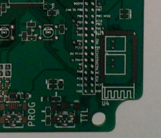

## Intro

rusefi firmwave currently supports two protocols for ECU monitoring & control

1. human-readable native protocol - connect to the ECU using HyperTerminal. This used to be protocol rusEfi console was using but not any more, we are moving towards not having text protocol enabled by default.

[List of commands](http://rusefi.com/wiki/index.php?title=Manual:Software:dev_console_commands)

[Java console code overview](http://rusefi.com/wiki/index.php?title=Manual:Software:dev_console_implementation)

2. binary protocol for integration with rusEfi console or http://www.tunerstudio.com/ tuning software
See [tunerstudio.cpp](https://sourceforge.net/p/rusefi/code/HEAD/tree/trunk/firmware/console/binary/tunerstudio.cpp) for a brief description of this binary protocol

For physical level rs232 is used ("serial port") - either via a FL232 chip or by emulating a USB device right within stm32f4. A bluetooth option is also available.

[Forum thread](http://rusefi.com/forum/viewtopic.php?f=5&t=210)

## Q&A

Q: Why two protocols? can you achieve the same results using both protocols?
A: Not really. Our text-based protocol has support for human-readable messages and it handles our own build-in logic anayzer - it is better for troubleshooting.
The protocol has better support for engine tuning in terms of editing individual cells on fuel maps etc.

Q: Is the binary protocol compatible with MegaSquirt?
A: Kind of, but not really. The general protocol is the same, but the packet format is rusEfi specific. All this works based on TunerStudio packet definition flexibility.
