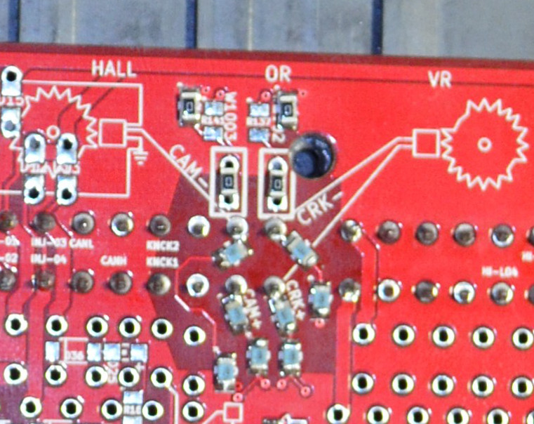

## Typical VR application

For example, 1995 Honda Accord (and most OBD-I Honda vehicle), 2003 Dodge Neon.

Use Trigger #1 N & Trigger #2 N wires with 0R pull-down configuration for sensor(s) negative side

Use Trigger #1 P & Trigger #2 P wires for sensor(s) positive side

## Bench testing VR configuration

Test 2.1: Expected ground on Trigger #1 N wire

Test 2.2: Expected ground on Trigger #2 N wire

Test 2.3: take an AA or AAA battery, connect Battery+ to Trigger #1 N wire, touch battery- with Trigger #1 P wire a couple of times. 
Then flip the battery and hold Battery+ to Trigger #1 P and touch Battery- with Trigger #1 N wire.
Should see event counter in ''triggerinfo'' go up

Test 2.4: take an AA or AAA battery, connect Battery+ to Trigger #2 N wire, touch battery- with Trigger #2 P wire a couple of times. 
Then flip the battery and hold Battery+ to Trigger #2 P and touch Battery- with Trigger #2 N wire.
Should see event counter in ''triggerinfo'' go up

Goto board info: http://rusefi.com/wiki/index.php?title=Manual:Hardware_Frankenso_board#VR_Input
