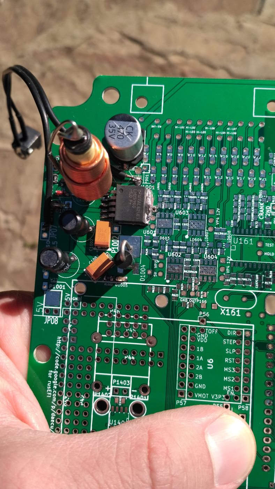

This page is dedicated to my experience with Frankenso 0.5 board, especially manual soldering and bringing it to life.

## Prerequisites

Mandatory links:
[Frankenso Hardware](Hardware_Frankenso)
https://rusefi.com/wiki/index.php?title=Manual:Hardware_Test_Mode 
https://rusefi.com/wiki/index.php?title=Manual:Software:TunerStudio_connectivity 
https://rusefi.com/wiki/index.php?title=Manual:Hardware_Frankenstein_board#step_3:_Analog_Inputs 
https://rusefi.com/wiki/index.php?title=Manual:Hardware_Trigger 
https://rusefi.com/wiki/index.php?title=Manual:Software_Temperature_Sensors 
https://docs.google.com/spreadsheets/d/1LTvS7I-128Hft9uXHG1JrBxetVjGJDSBkySgVDQ6MGk/edit#gid=0

First you need the board. Then you need the components. I decided to select and buy the components step-by-step.

Before you begin it would be helpful if you have experience with KiCad. Sometimes it is more convenient to use it to explore the schematic and the PCB files.
The latest Frankenso files can be found here: https://github.com/rusefi/rusefi/tree/master/hardware/frankenso

## Helpful files

* [frankenso.csv ](https://github.com/rusefi/rusefi/blob/master/hardware/frankenso/frankenso.csv)
* [frankenso_PCB.pdf](https://github.com/rusefi/rusefi/blob/master/hardware/frankenso/frankenso_PCB.pdf)
* [frankenso_schematic.pdf](https://github.com/rusefi/rusefi/blob/master/hardware/frankenso/frankenso_schematic.pdf)

Make sure to look at the file frankenso.csv. This is a list of the components of the board. You can import it with program like MS Excel or other CSV (comma separated values) viewer.
In MS Excel you can import it going to tab "Data", select "From Text" from "Get External Data" group, now you browse to the file and select it, "Import" , "Delimited" (next) , You chose "Comma", then Finish. Here is a pdf version of the file. I printed it in order to make  a quick reference.

I made the table borders black, set the page margins to "Narrow" , orientation to "Landscape", forced "Wrap text" to the first column in order to fit all the components in one row, and all this in order to make everything on single page. You can see the file [[File:Frankenso-0.5-components.pdf]]. It is best to print this list.

Next is to print all the pages from frankenso_schematic.pdf. Currently there are 15 pages. This is the most important think to do because you'll use it to note the soldered and the remaining components to be soldered.

## Identifying the different sections

I decided to start with the power supply / voltage converter. After the required output voltage is available (no chance to burn the components on the first run) I choose the MCU, because it is much more easier to solder in the absence of the other components. You can actually start with it if you feel more comfortable to solder LQFP-100 on bare board. The jumper W23 connects the 5V output from the buck converter to the power plane.

**If you aren't experienced in soldering LQFP or similar packes better go with the development board! The price is not much higher and you'll save a lot of time.** My idea to solder the MCU directly to the board was to decrease the lengths of the tracks in order to decrease noise.

The remaining parts I group by the engine components, see the following table:

### Engine components
* Crankshaft position sensor 
* Camshaft position sensor
* Mass Air Flow sensor
* Throttle position sensor
* Knock sensor

## Step 1 - Voltage converter

