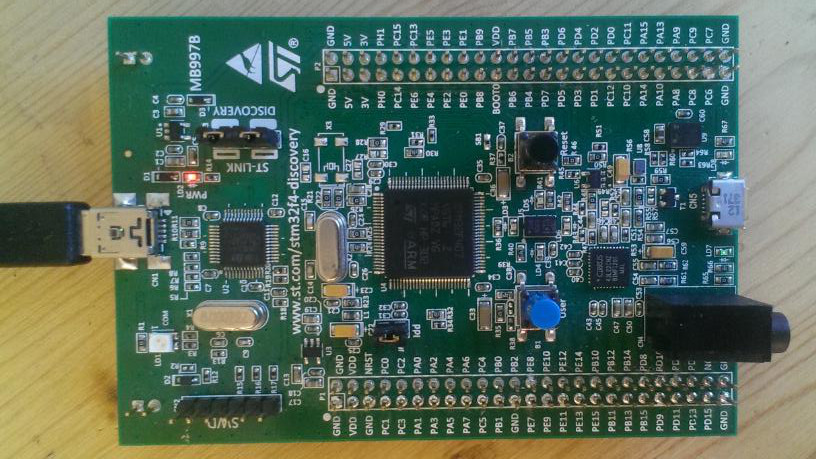
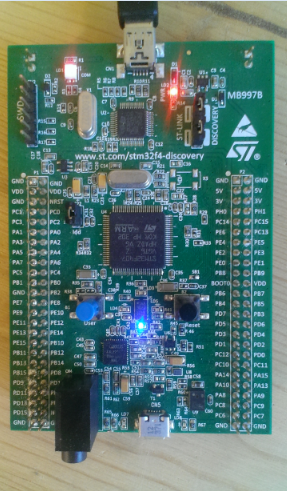
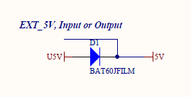
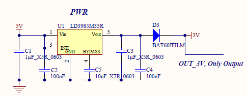

See also http://rusefi.com/wiki/index.php?title=Hardware:Troubleshooting

## Summary

So you think you broke your discovery, good news, we have some tips for diagnostics and some suggestions for solutions. Fear not there is likely some good news below. For this diagnostics, we will assume you have removed the discovery from what ever circuit it was connected to and it is only being connected via "CN1" USB jack on SWD side of the board. The board should be something like the below picture. 

## Diagnostics steps

### Step 1 Check the power supply and programming chip
#### Setup the Discovery like this
* With USB not connected, remove Idd jumper JP1.
* Plug in to USB power,

#### Description of what is being check
This prevents the 3V from making it to the target ST chip. This will isolate the part of the board you may have damaged. It will likely remove stray loads and will allow you to test if the power supply and SWD programming chip is functional. 

#### Check(s) to determine what solution to follow.
* Does the red LD2 "PWR" go bright RED? -- If so your power supply is probably in good order. Go to solution **Step 2**. If the LED is dim, proceed to the next line.
* Is LD1 "COM" solid red and LD2 "PWR" dim? -- If so this is good, it means you are getting 5V via USB and the programmer chip is probably functional. If it is red, proceed to **Solution 1 Broken D3** else proceed to the next line.
* Is LD1 "COM" green? -- If so this means you have 3V and ??? (I don't know when it will be green). If it's green or blinks green when communicating with it, this means you have 3V and your LD2 "PWR" light is broken. Proceed to **Solution 3 Broken LD1** else proceed to the next line.
* Is LD1 "COM" blinking red? -- If so this could be and could be indicating the processor is active and doing stuff. TBD inquire in the forums for help. 
* Is LD1 dim -- TBD ask in the forums for help.
* Are all LED's off? -- If so this likely means there was a 5V short to GND and D1 has broken. To really check, with a multi-meter measure  DC voltage referenced to GND like at JP2 or JP3. Measure the voltage at both sides of D1. If you measure 5V at one side and less than 100mV on the other side, proceed to **Solution 2 Broken D1** If you measure below 100mV on both sides, 5V is not making it to this board, check your USB is providing 5V. 

### Step 2 Check the target ST chip
#### Setup the Discovery like this
TBD

#### Description of what is being check
TBD

#### Check(s) to determine what solution to follow.
TBD

reference forum suggestion for repair found here http://rusefi.com/forum/viewtopic.php?f=4&t=653&start=16

## Solutions
### Solution 1 Broken D3
#### Fix 1
You may notice that D1, D2, D3 are the same. You probably don't use D2, as R2 is not populated by default. You can probably safely re-purpose that diode. If you have a second broken board, you can probably scavenge a diode from another dead board. If replace the diode, before you power it up, carefully check that the line on the diode looks like it does in the picture. If it's installed backwards, the board will not turn on. It will act like the diode is broken. Once this repair has been made, start the diagnostics process over. 

#### Fix 2
Easiest solution is to get a new D3 which can be found [http://www.digikey.com/product-detail/en/BAT60JFILM/497-3707-6-ND/1848703?WT.z_cid=ref_octopart_dkc_buynow&site=us here at digikey] or [http://octopart.com/partsearch#!?q=BAT60JFILM%0D%0A here at octopart] If you replace the diode, before you power it up, carefully check that the line on the diode looks like it does in the picture. If it's installed backwards, the board will not turn on. It will act like the diode is broken. Once this repair has been made, start the diagnostics process over.  

#### Fix 3
Replace with some other diode you have kicking around int the junk box. Once this repair has been made, start the diagnostics process over.

#### Fix 4
You can remove the diode and install a little jumper wire. However be careful as a short to GND now could damage your regulator, and it's much harder to replace the regulator. Once this repair has been made, start the diagnostics process over.

### Solution 2 Broken D1
#### Fix 1
See "Solution 1 Broken D3" but change the D1 diode instead. Once this repair has been made, start the diagnostics process over.

### Solution 2 Broken D1
#### Fix 1
Replace the LED or ignore it. This is only an indicator that you have 3V. 

## general information

[BOM archive](http://www.st.com/st-web-ui/static/active/en/resource/technical/document/bill_of_materials/stm32f4discovery_bom.zip)

https://rusefi.com/wiki/index.php?title=File:Stm32f4discovery_schematics.pdf

## Normal measurements
Here are several measurements to function as a point of reference. These were taken with a known good board.

With the USB powering the board via CN1 and JP1 removed, 
* Voltage referenced to GND is 
Voltage measurements
||Away from audio jack|closer to audio jack
|D1|4.76V|5.08V
|D3|3.298V|2.968V
|JP1|2.968V|.3mV

With no USB and no other connections to the discovery, 
* the measured ohms (auto scale) to GND with JP1 removed, The SWD side of JP1 measured at 7.34k ohms, and the audio jack side of JP 1 measured at 4.98k ohms.

## common parts

D1, D2, D3: BAT60JFILM

U1: LD3985M33R

U3: LD3985M25R

## Scenario: Normal operation

You plug discovery into a powered mini USB cable and both LD1 and LD2 are bright red.

## Scenario: Full darkness

You plug discovery into a powered mini USB cable and discovery is totally dark

## Scenario: A drop of life

You plug discovery into a powered mini USB cable and there is bit of light on LD2 but nothing on LD1.

## checks

### Check #1: D1
With mini USB supplying power both sides of D1 should show about +5v. If not D1 might be at fault.

### Check #2: U1

With mini USB supplying power bottom-right pin on U1 should show ~3v. If it's below 2v, U1 might be faulty.

LD3985M33R

On the discovery board the chip is upside-down.

## stats
Repaired by D1 replacement: 1
